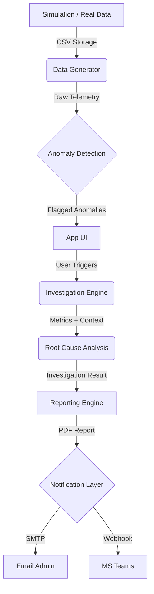

# AI-Driven ONTAP Storage System Manager - Project Documentation

## 1. Executive Summary

This project implements a next-generation **AI-Driven Storage Management Interface** mimicking the NetApp ONTAP System Manager. It integrates advanced machine learning algorithms to proactively detect, analyze, and diagnose storage performance anomalies (Latency, IOPS, Throughput) in real-time.

The core value proposition is **Autonomous Operations (AIOps)**: moving from reactive monitoring ("The system is slow") to proactive, explainable AI ("The VDI volume is experiencing a boot storm; latency is up, but backend disk health is normal").

## 2. Business Objective and Scope

### Objective
*   **Reduce MTTD (Mean Time to Detect) & MTTR (Mean Time to Resolution):** By automating the "Is this an anomaly?" and "What caused it?" analysis steps.
*   **Enhance User Experience:** Provide a familiar, premium UI (NetApp-style) enriched with AI insights.
*   **Proactive Alerting:** Notify admins via Email and MS Teams with actionable, evidence-based reports (PDFs with graphs).

### Scope
*   **UI:** Streamlit-based replica of ONTAP System Manager (Dashboard, Volume List, Detail View).
*   **AI Engine:** Statistical baseline tracking + Heuristic Rule Engine for Root Cause Analysis (RCA).
*   **Simulation:** Capability to inject realistic faults (Noisy Neighbor, Boot Storm, Disk Failure) to validate the AI.
*   **Reporting:** Auto-generated PDF forensic reports with historical context and performance graphs.

## 3. System Architecture

The system follows a modular **Micro-Service-Lite** architecture within a Python ecosystem.

*   **Frontend (UI):** Streamlit (Python). Renders the visual interface, charts (Altair), and handles user interaction.
*   **Backend Logic:** Python.
    *   **Data Generation:** Simulates storage telemetry (Latency, IOPS, MB/s) with seasonality and noise.
    *   **Anomaly Detection:** `pandas`-based statistical engine (Z-Score / Standard Deviation analysis).
    *   **Investigation Engine:** Python rule-based expert system connecting symptoms to root causes.
*   **Notification Layer:**
    *   **Email:** SMTP (Gmail OAuth2) for delivering PDF reports.
    *   **Chatops:** MS Teams Webhook for instant alerts.

## 4. Component Level Architecture

1.  **`app.py` (Orchestrator):**
    *   Main entry point.
    *   Manages Session State (Navigation, Selected Volume).
    *   Renders Sidebar, Header, and Main Content (List/Detail views).
    *   Triggers Simulation and Investigation flows.

2.  **`data_generator.py` (Telemetry Engine):**
    *   Generates synthetic time-series data (30 days history).
    *   `inject_latency_spike()`: Injects specific failure patterns (Contention, Burst, Stall) retroactively into the data.
    *   `inject_normal_data()`: Cleans up recent anomalies for "Normalization".

3.  **`anomaly_detection.py` (Statistical Engine):**
    *   `calculate_baseline()`: Computes hourly Mean/StdDev for every volume.
    *   `detect_anomalies()`: Flags data points > N standard deviations from the mean.
    *   Assigns Severity (High/Medium/Low).

4.  **`investigation.py` (Reasoning Engine):**
    *   `analyze_behavior()`: Correlates Latency vs. IOPS/Throughput.
        *   *High Latency + High IOPS* = Workload Surge.
        *   *High Latency + Low IOPS* = Backend Stall.
    *   `determine_root_cause()`: Maps behaviors to human-readable root causes.

5.  **`reporting.py` (Reporter):**
    *   Generates PDF documents using `fpdf`.
    *   Creates matplotlib charts for visual evidence.
    *   Calculates exact incident duration and timestamps.

6.  **`alerting.py` (Notifier):**
    *   Handles Gmail OAuth2 authentication.
    *   Sends Emails with PDF attachments.
    *   Posts rich cards to MS Teams.

## 5. Data Flow Diagram



## 6. AI and ML Design Concepts and Principles

### A. Statistical Baselining (Unsupervised Learning Concept)
Instead of hardcoded thresholds (e.g., "Alert if Latency > 10ms"), the system uses **Dynamic Baselining**.
*   It calculates the "Normal" behavior for *this* volume at *this* hour of the day.
*   **Principle:** Anomaly is defined as a statistically significant deviation (Z-Score > 3) from the historical norm.

### B. Heuristic Behavioral Analysis (Expert System)
We employ **Explainable AI (XAI)** principles. Instead of a "Black Box" Neural Network, we use a Decision Tree logic based on storage physics.
*   **Logic:** Latency is rarely an isolated metric. It is a function of Demand (IOPS) and Capacity (Throughput).
*   **Rule:** If Demand is *Low* but Latency is *High*, the constraint *must* be internal (e.g., Disk failure, CPU saturation).
*   **Benefit:** This provides the "Why" (Reasoning) which is critical for IT Operations.

## 7. Technical Specification

*   **Language:** Python 3.11+
*   **Frameworks:** Streamlit (UI), Pandas (Data), Matplotlib/Altair (Viz).
*   **Libraries:** `fpdf` (PDF), `requests`, `python-dotenv` (Config), `google-auth` (Security).
*   **Storage:** Local CSV (Simulation of a Time-Series Database).
*   **Security:** OAuth2 for Email, Environment Variables (`.env`) for secrets.

## 8. Requirements

See `requirements.txt` for the full list of Python dependencies. Key packages:
*   `streamlit`
*   `pandas`
*   `matplotlib`
*   `fpdf`
*   `google-auth-oauthlib`

## 9. User Guide

### 9.1 Dashboard & Navigation
*   **Sidebar:** Use the left menu to navigate between the "Dashboard", "Storage", "Network", etc.
*   **Volumes List:** The default view showing all volumes.
    *   Click "Volumes" in the sidebar to return here.
    *   **Search/Filter:** Use the "Search" bar in the header (visual mock).

### 9.2 Investigating a Volume
1.  Click on any Volume Name (e.g., `vol_vdi_boot`) in the list.
2.  You will be taken to the **Volume Details** page.
3.  View the **Performance Graph** to see the 24-hour trend.

### 9.3 Simulating an Anomaly
1.  In the Volume Details page, look for the **Simulation** box (right column).
2.  Click **"⚠️ Trigger Latency Spike"**.
3.  **Wait 2-3 seconds.** The AI will:
    *   Inject a fault into the historical data (ending 'Now').
    *   Analyze the pattern.
    *   Generate a PDF report.
    *   Send Notifications (Email/Teams) if configured.
4.  A "Success" toast will appear, and the page will reload showing the spike.

### 9.4 Normalizing (Healing)
1.  In the Simulation box, click **"✅ Normalize Performance"**.
2.  The system will clear the recent spike history and restore the graph to a healthy baseline.

## 10. Quick Start

### Prerequisites
*   Python 3.11 installed.
*   Microsoft Teams Webhook URL (optional).
*   Gmail OAuth2 Credentials (optional, for email alerts).

### Installation
1.  Clone the repository.
2.  Install dependencies:
    ```bash
    pip install -r requirements.txt
    ```
3.  Configure `.env`:
    *   Create a `.env` file in the root.
    *   Add:
        ```ini
        GMAIL_USER=your_email@gmail.com
        TEAMS_WEBHOOK_URL=your_webhook_url
        # Add OAuth Client/Secret if using Email
        ```

### Running the App
1.  Run the Data Generator (First time only):
    ```bash
    python data_generator.py
    ```
2.  Launch the UI:
    ```bash
    streamlit run app.py
    ```
3.  Open your browser to `http://localhost:8501`.
